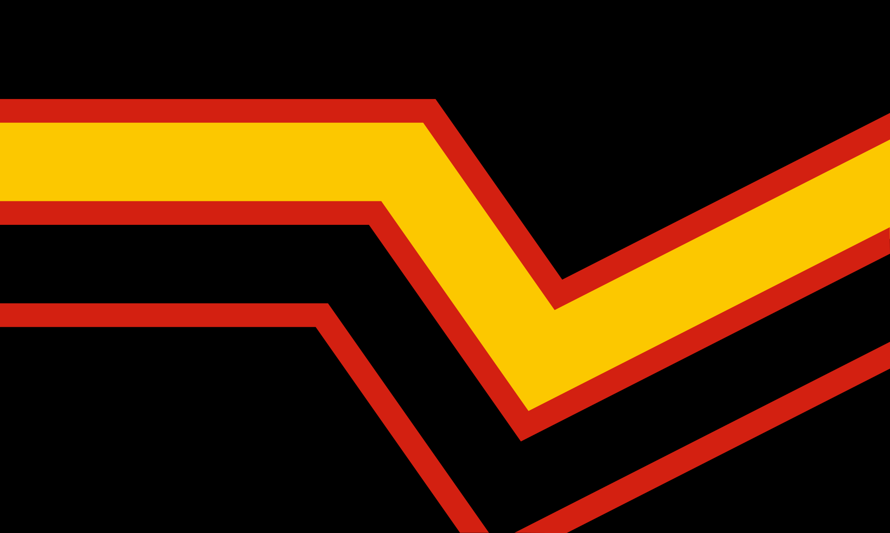

# The Latex List 

This is an online repository for latex/rubber fetishists, cataloging designers, shops, models, photographers, communities, events and more. This list is *only* for latex/rubber, not PVC or similar materials.

It acknowledges the work of the (now defunct) [*latexcouture.esy.es*](https://web.archive.org/web/20170715090954/http://latexcouture.esy.es/) and continues the original [nahkampf/latexfetish](https://github.com/nahkampf/latexfetish) list.

## Categories
- [Designers](docs/designers.md)
- [Shops, Retailers & Resellers](docs/shops.md)
- [Models](docs/models.md)
- [Photographers & Gallery Sites](docs/photographers.md)
- [Communities](docs/communities.md)
- [Events](docs/events.md)
- [Magazines & Media](docs/magazines.md)
- [Resources](docs/resources.md)
- [Care & Maintenance](docs/care.md)

## Contributing

Additions and corrections are welcome - feel free to make a pull request.

- Entries live in the JSON files under [`data/`](data/). The pages under [`docs/`](docs/) are **generated** from them, so don't edit those by hand.
- Focus on quality over quantity.
- Dead or stale links are kept for archival purposes and marked with a `label` such as `Dead`, `Empty`, `Old` or `Redirect`.

An entry looks like this:

```json
{
  "name": "Example Latex",
  "country": "de",
  "links": [
    { "platform": "website", "url": "https://www.example.com" },
    { "platform": "instagram", "url": "https://www.instagram.com/example", "label": "Old" }
  ]
}
```

Optional keys:
`countries` (a list of codes instead of `country`, for entries spanning several countries),
`gender` (models: `female`, `male` or `other`),
`former_name`, `type` (e.g. `book`, `video`) and
`note`.

The valid `platform` ids and country codes are listed in [build_list.py](build_list.py).

After editing a JSON file, normalize it and regenerate its page:

```sh
python build_list.py data/designers.json --sort-json
python build_list.py data/designers.json -o docs/designers.md
```

A new platform needs an icon in [`assets/icons/`](assets/icons/) and an entry in the `PLATFORMS` table - [get_favicon.py](get_favicon.py) downloads a site's favicon for that.

## Credits
- Flag icons are from [Twemoji](https://github.com/twitter/twemoji) by Twitter/X contributors, licensed under [CC-BY 4.0](https://creativecommons.org/licenses/by/4.0/).
- The rubber pride flag is based on the design by Peter Tolos and Scott Moats (1994).
- Platform icons are trademarks of their respective services and are used for identification only.
